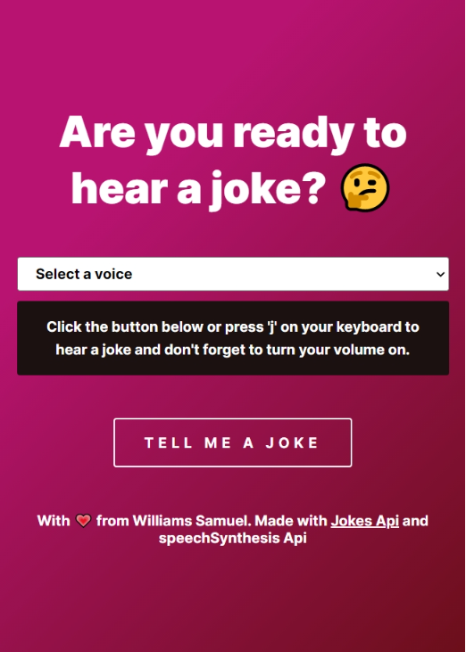

# DevProjects - Joke telling bot web app

This is an open source project from [DevProjects](http://www.codementor.io/projects). Feedback and questions are welcome!

Find the project requirements here: [Joke telling bot web app](https://www.codementor.io/projects/web/joke-telling-bot-web-app-cjd2eyrfak)

## Tech/framework used

Built with HTML, CSS and Vanilla JS

I made use of [Jokes API](https://sv443.net/jokeapi/v2/) and SpeechSynthesis API in the browser to read out the jokes.

## Screenshots and demo

-   Live Demo: [Jokes Web Bot](https://williamssam.github.io/jokes-web-bot/)

## License

[MIT](https://choosealicense.com/licenses/mit/)
Most open source projects use the MIT license. Feel free to choose whichever license you prefer.
